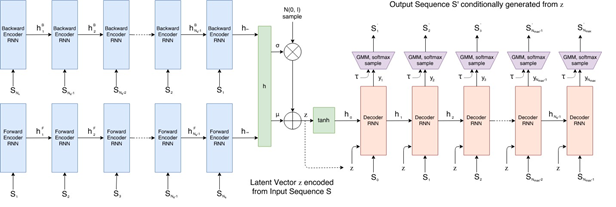
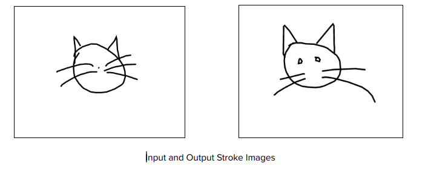

# Sketch_gen
This project is made under ISTE’s special interest group called crypt
## The model


Sketch-RNN is a Recurrant Neural Network which consists of a Sequence to Sequence Variational Autoencoder (Seq2SeqVAE), which is able to encode a series of pen strokes (a sketch) into a latent space, using a bidirectional LSTM as the encoder. The latent representation can then be decoded back into a series of strokes.
The model is trained to reconstruct the original stroke sequences while maintaining a normal distribution across latent space elements. Since encoding is performed stochastically, and so is the sampling mechanism of the decoder, the reconstructed sketches are always different.
This allows to let a trained model draw new and unique sketches that it has not seen before. Designing the model as a variational autoencoder also allows to perform latent space manipulations to get interesting interpolations between different sketches.
 
## The dataset 
The dataset is by google creative lab. The method of collecting the data was a game called quickdraw where people draw a sketch of the word displayed.
The format of data is stroke 3 format which consists of x and y coordinates and a ‘0’ or ‘1’ denoting pen down and pen up.
The format is a sequential format which stores the changes in pen position and the sketch is represented stroke by stroke
## Implementation Details
First, clone this repo and follow the instructions
###### Training
To train the model, you need a dataset in the appropriate format. You can download one of many prepared sketches datasets that were released by Google
[by clicking here](https://console.cloud.google.com/storage/browser/quickdraw_dataset/sketchrnn?pli=1)
and put the dataset in a directory in the sketch_rnn directory

use:

````python seq2seqVAE_train --data_dir=<name_of_the_directory_where_datasets_are> --data_set=<name_of_dataset(if using multiple datasets, use a list-[]> --experiment_dir=\sketch_rnn\experiments ````   
## Functionality
Functions include: 

Interpolate- Used to create an interpolation series of length ‘n’ between 2 sketches

 Encode : encodes a sketch into latent space
 
Decode : decodes sketch from latent space

Encode and decode has another argument called temperature which controls the randomness of stroke length which basically sets how similar the decoded sketch is from the encoded one.
## Example Output



